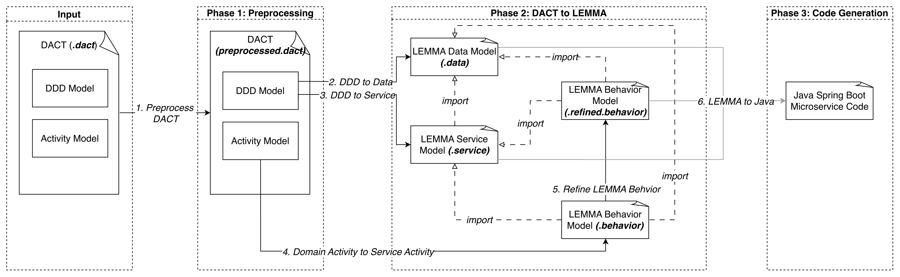
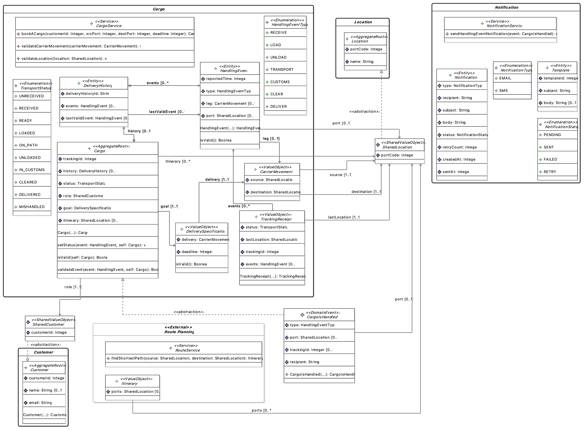

# DACT — Domain and ACTivity

A graphical DSL for modelling Domain-Driven Design (DDD) concepts together with the behaviour of their operations, and a model-driven transformation chain that generates functional Java microservice code from those models.

This repository accompanies the thesis *Incorporating Behavioral Specification into Domain Driven Design For Microservice Code Generation* and contains the
proof-of-concept implementation: the DACT metamodel and editor, the adapted LEMMA metamodels used as an intermediate representation, the transformation
implementation, and the validation examples. The transformation workflow is shown in [Figure 1](#fig1). 

   
  <em>Figure 1: Transformation workflow from DACT models to microservice code.</em>

## Repository structure

| Directory | Contents |
|---|---|
| `metamodels` | The metamodels of input and intermediate artifacts|
| `metamodels/dact.metamodel*` | DACT metamodel defined with Xcore |
| `metamodels/lemma.adapted.data.metamodel*` | Adapted LEMMA data metamodel defined with Xcore |
| `metamodels/lemma.adapted.service.metamodel*` | Adapted LEMMA service metamodel defined with Xcore|
| `metamodels/lemma.adapted.technology.metamodel*` | Adapted LEMMA technology metamodel defined with Xcore|
| `metamodels/lemma.adapted.behavior.metamodel` | New LEMMA behaviour metamodel defined with Xcore|
| `notations` | Textual and graphical notations of DACT|
| `notations/dact.dsl*` | Textual notation of DACT defined with Xtext|
| `notations/dact.design` | Graphical notation of DACT defined with Sirius providing DACT editors |
| `transformations` | Transformation workflow |
| `transformations/dact-to-lemma` | DACT-to-LEMMA M2M Transformation covering phase 1 and 2|
| `transformations/dact.code.generator` | LEMMA-to-Java Transformation covering phase 3 |
| `initProjects.sh` | Script to initialize Java Spring Boot project |
| `cleanProjectssh` | Script to clean projects partially or fully |
| `evaluation` | Scripts and results for validations |
| `evaluation/scripts/` | Scripts and results for validations |
| `evaluation/results/` | Validation results |
| `evaluation/results/well-formedness` | Result for well-formedness verification of DACT |
| `evaluation/results/expressiveness` | Result for expressiveness validation of DACT |
| `evaluation/results/trans-correctnesss` | Result for correctness verification of DACT-to-Java workflow |
| `evaluation/results/behavioral-correctnesss` | Result for behavioral correctness verification of generated Java code |

## Prerequisites

- Eclipse Modeling Tools ([version])
- Xtext and Xcore ([version])
- Sirius ([version])
- QVT Operational ([version])
- Acceleo ([version])
- Java [version] and Maven [version] for building the generated services

## Getting started

1. Import all Xcore metamodel (`metamodels/*`) and Xtext (`notations/dact.dsl*`) projects into an Eclipse workspace (*File → Import → Existing Projects into Workspace*). -> Parent workspace.
3. Launch a runtime Eclipse instance with all plugins in current workspace (*Run → Run Configurations → Eclipse Application*). -> Child workspace
4. Import Sirius editor (`notations/dact.design`) and transformation (`transformation/*`) projects into the child workspace.
5. [Optional] Import JUnit6 evaluation module (`dact.validation`) and the model parser with statistics (`dact.stats.generator`) to run evaluation.

## Running the transformation

1. Open a DACT model from `evaluation/results/behavioral-correctness/phase1/cargo.dact` or create a new one through the Sirius editor.
2. Run the QVTo transformation (`transformations/dact-to-lemma/transform/index.qvto`) to produce preprocessed DACT, LEMMA data, service, and behaviour models.
3. Initialize a Spring Boot project for each generated microservice with the dependencies (`transformations/initProjects.sh`). Refer to the `transformations/README` for details.
4. Run the Acceleo generation (`transformations/dact.code.generator/src/generate.mtl`) on the resulting behaviour model to produce the Java sources. The service and data models are resolved automatically through the shared resource set, so only the behaviour model is passed as input.

## Example
The Cargo case study is the running example used throughout the thesis. It models 5 bounded contexts, 9 user stories and 42 scenarios ([Figure 2](#fig2)).

   
  <em>Figure 2: Domain Models of Cargo Shipping system expressed with DACT.</em>

## Current scope

The implementation is a proof of concept and does not cover the full transformation described in
the thesis. In particular:

- Only synchronous inter-service communication is generated; the asynchronous path is specified but not implemented;
- The generated service layer is not separated into domain and application services.

## TODO
- [ ] Async communication
- [ ] Update site for the whole project

## License

[license]
